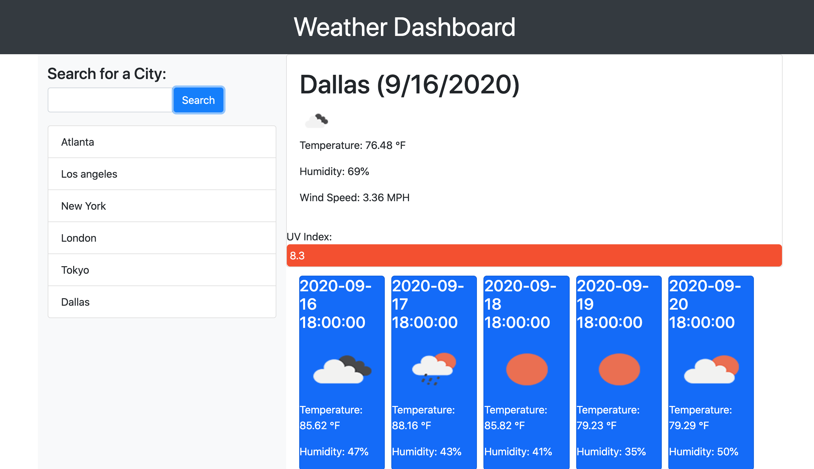

# server-side-apis-HW

## Description 

This project is an app that shows the current weather and the 5 day forecast of an city that the user searchs.The user's search history will be saved so that they can come back to this page and easily access their city'sweather.

## Table of Contents

* [Usage](#usage)
* [Credits](#credits)
* [License](#license)

## Usage 

In order to access this application, the user can click on the link below to the home page of the website. From there they can use the navbar at the top to navigate the website.

* [Weather Dashboard](https://patrickhannan.github.io/server-side-apis-HW/)

From there, the user can enter their city in the search bar. They will shown the city, the date, temperature, humidity, and wind speed at the moment, as well as 5 forecast cards for their city.

Below is a image of how the page will look when the user enters a city into the search bar and clicks search.

## Credits

* [Bootstrap](https://getbootstrap.com/)
* [Openweather API](https://openweathermap.org/)
* [Moment.js](https://momentjs.com/)

## License

MIT License

Copyright (c) 2020 Patrick Hannan

Permission is hereby granted, free of charge, to any person obtaining a copy of this software and associated documentation files (the "Software"), to deal in the Software without restriction, including without limitation the rights to use, copy, modify, merge, publish, distribute, sublicense, and/or sell copies of the Software, and to permit persons to whom the Software is furnished to do so, subject to the following conditions:

The above copyright notice and this permission notice shall be included in all copies or substantial portions of the Software.

THE SOFTWARE IS PROVIDED "AS IS", WITHOUT WARRANTY OF ANY KIND, EXPRESS OR IMPLIED, INCLUDING BUT NOT LIMITED TO THE WARRANTIES OF MERCHANTABILITY, FITNESS FOR A PARTICULAR PURPOSE AND NONINFRINGEMENT. IN NO EVENT SHALL THE AUTHORS OR COPYRIGHT HOLDERS BE LIABLE FOR ANY CLAIM, DAMAGES OR OTHER LIABILITY, WHETHER IN AN ACTION OF CONTRACT, TORT OR OTHERWISE, ARISING FROM, OUT OF OR IN CONNECTION WITH THE SOFTWARE OR THE USE OR OTHER DEALINGS IN THE SOFTWARE.